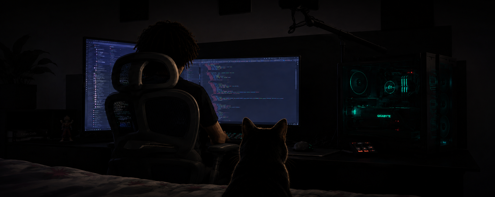

# Henrique "Rick" Alves

Gosto de criar coisas. Às vezes são fotos, às vezes são projetos, às vezes são ideias que começam como “e se...” e acabam tomando proporções completamente desnecessárias. Minha cabeça nunca para e, assim como o Hulk está sempre com raiva, eu estou sempre tendo ideias. É meu superpoder.

Também sou desenvolvedor backend e vivo nesse loop entre a coceira na cabeça para resolver uma demanda e o sorriso de orelha a orelha quando vejo o resultado.

Gosto de fotografia, tanto real quanto virtual — luz é luz, afinal de contas. 📷

Também estou sempre lendo novels, especialmente quando encontro alguma história com fantasia ou ficção no meio.

## Fora do código

🎮 **Dota 2** — geralmente jogando com os amigos 🐿️

🏍️ **Motos custom** — sempre existe uma que eu já estou imaginando como modificaria

🐈 **Um gato** — que claramente considera a casa propriedade particular dele

📷 **Fotografia** — real, virtual, Cyberpunk 2077, Forza Horizon 6, qualquer lugar onde dê para brincar com luz realista

🎬 **Filmes, séries e livros** — especialmente quando tem fantasia ou ficção no meio

🎧 **Música** — fã eterno de **Charlie Brown Jr.** e provavelmente o único ouvinte de **Nightcore** da minha cidade

🕺 **Baile charme** — porque aparentemente também gosto de resolver problemas dançando

## Lindvior

Uma dessas ideias que foi ficando grande.

O **Lindvior** é uma plataforma de gerenciamento e simulação de estacionamento que estou construindo para colocar em prática algumas das ideias que gosto de explorar em backend e arquitetura.

**[→ Ver o Lindvior](https://github.com/RickAvles/Lindvior)**

## Tecnologias

`Java` · `Spring Boot` · `PostgreSQL` · `Oracle` · `Kafka` · `RabbitMQ` · `Redis` · `Docker`
